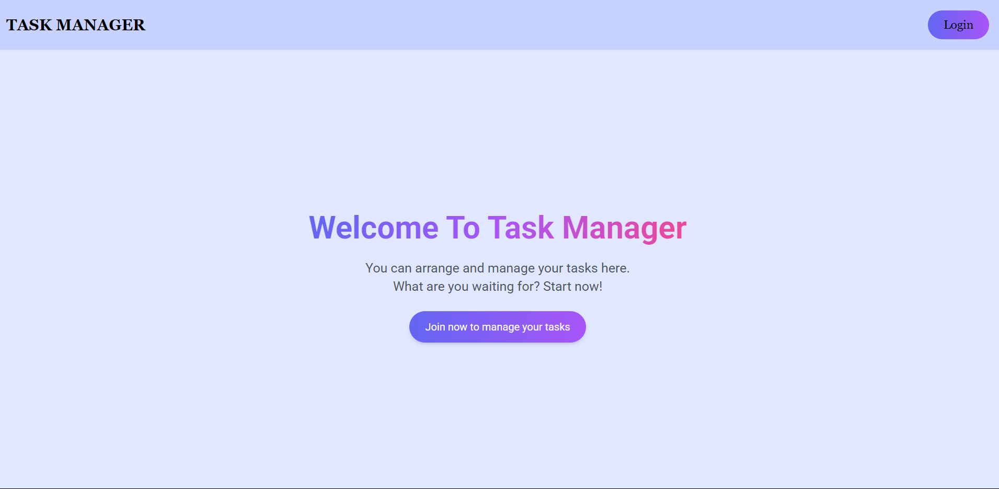
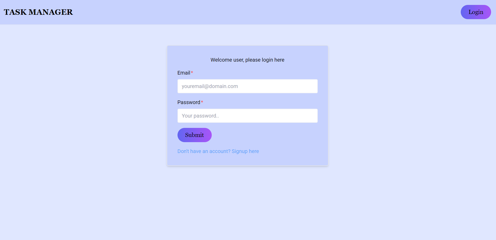
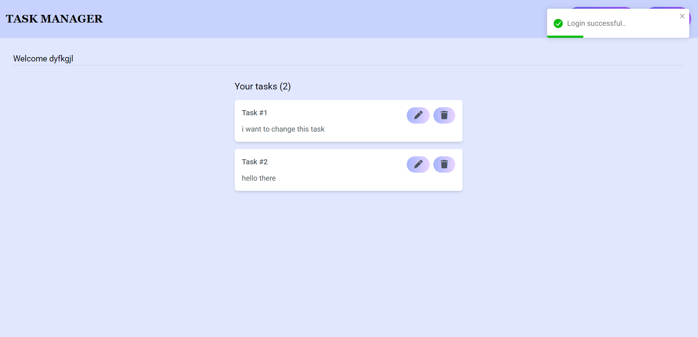

# Task Management Application

## Overview
A simple yet powerful task management application built using the MERN (MongoDB, Express.js, React, Node.js) stack. This application allows users to manage their tasks efficiently with features like authentication, CRUD operations, and a responsive interface.





---

## Table of Contents
1. [Highlights](#highlights)
2. [Tech Stack](#tech-stack)
3. [Core Dependencies](#core-dependencies)
4. [Dev Dependencies](#dev-dependencies)
5. [System Requirements](#system-requirements)
6. [Setup Instructions](#setup-instructions)
7. [API Endpoints](#api-endpoints)
8. [Scripts Overview](#scripts-overview)

---

## Highlights
### For Users
- Register and log in securely.
- Add, view, edit, and delete tasks.
- Responsive design for seamless use across devices.
- Redirects and protected routes for enhanced user experience.
- Personalized task dashboard.

### For Developers
- Success and error messages with Toast notifications.
- Built-in form validation on both client and server sides.
- Token-based authentication for secure user sessions.
- Global state management using Redux.
- Tailwind CSS for styling with no external CSS files.
- Dynamic document titles for better SEO and usability.
- Custom hooks and reusable components.
- Middleware for authentication in the backend.
- Organized project structure and standard coding practices.

---

## Tech Stack
- **Frontend**: React, Redux, Tailwind CSS
- **Backend**: Node.js, Express.js
- **Database**: MongoDB

---

## Core Dependencies
- `axios`
- `react`
- `react-dom`
- `react-redux`
- `react-router-dom`
- `react-toastify`
- `redux`
- `redux-thunk`
- `bcrypt`
- `cors`
- `dotenv`
- `express`
- `jsonwebtoken`
- `mongoose`

---

## Dev Dependencies
- `nodemon`
- `concurrently`

---

## System Requirements
- Node.js installed on your machine.
- Access to a MongoDB instance.
- A code editor, preferably Visual Studio Code.

---

## Setup Instructions
1. Clone the repository:
   ```bash
   git clone https://github.com/ankitsharma495/taskmanager
## API Endpoints

### Authentication Routes
- **POST** `/api/auth/signup` - Register a new user.
- **POST** `/api/auth/login` - Log in a user.

### Task Routes
- **GET** `/api/tasks` - Fetch all tasks.
- **GET** `/api/tasks/:taskId` - Get a specific task.
- **POST** `/api/tasks` - Add a new task.
- **PUT** `/api/tasks/:taskId` - Update an existing task.
- **DELETE** `/api/tasks/:taskId` - Delete a task.

### Profile Route
- **GET** `/api/profile` - Retrieve the logged-in user's profile information.

---

## Scripts Overview

### Root-Level Scripts
- `npm run dev`: Starts both the backend and frontend simultaneously in development mode.
- `npm run dev-server`: Starts the backend server only.
- `npm run dev-client`: Starts the frontend application only.
- `npm run install-all`: Installs all dependencies and dev-dependencies across the project (root, frontend, and backend).

### Frontend Scripts
- `npm start`: Starts the frontend in development mode.
- `npm run build`: Builds the frontend for production (output is saved in the `build` directory).
- `npm test`: Launches the test runner in interactive watch mode.
- `npm run eject`: Removes the single build dependency from the frontend.

### Backend Scripts
- `npm run dev`: Starts the backend server with live reload using `nodemon`.
- `npm start`: Starts the backend server without `nodemon`.


